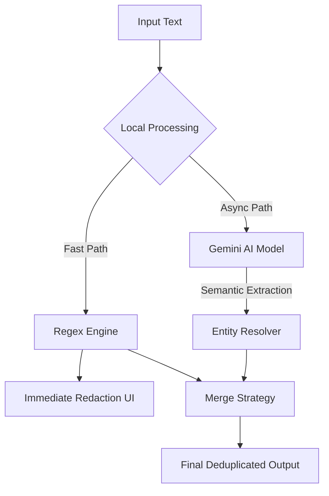

# RedactAI - Intelligent Cybersecurity Redaction System

[](https://moonlit-praline-99f1a1.netlify.app/)
[](LICENSE)
[](https://react.dev/)
[](https://ai.google.dev/)

**RedactAI** is a high-performance privacy protection engine built for the **Cybersecurity Hackathon**. It employs a hybrid architecture, orchestrating **Google Gemini** for semantic entity recognition and **optimized Regex patterns** for structured data validation. This ensures maximum recall and precision when redacting sensitive information from unstructured text streams.

---

## Live Demo

**Access the application here:** [https://moonlit-praline-99f1a1.netlify.app/](https://moonlit-praline-99f1a1.netlify.app/)

---

##  System Architecture

RedactAI utilizes a **Progressive Redaction Pipeline** to minimize latency while maximizing accuracy.



1.  **Layer 1 (Fast Path)**: Immediate client-side regex evaluation for structured entities (IPs, Emails, Credit Cards, Dates). Latency: <10ms.
2.  **Layer 2 (Deep Path)**: Asynchronous call to `gemini-2.5-flash` (or `gemini-3-pro` in High Accuracy mode) to identify context-heavy entities (Person Names, Generic Locations).
3.  **Resolution Layer**: A merging algorithm consolidates overlapping indices, prioritizing the most specific entity type and ensuring no text is double-redacted.

---

## 📂 Project Structure

```bash
redact-ai/
├── src/
│   ├── components/       # UI Components (atomic design)
│   │   ├── AccuracyMetric.tsx  # Levenshtein visualization
│   │   ├── EntityTable.tsx     # Data grid for entities
│   │   └── RedactionPanel.tsx  # Main business logic container
│   ├── services/
│   │   └── geminiService.ts    # AI API abstraction layer
│   ├── utils/
│   │   └── textUtils.ts        # Core algo (LCS, Regex, Normalization)
│   ├── types.ts          # TypeScript interfaces & Enums
│   ├── App.tsx           # Root component
│   └── index.tsx         # Entry point
├── public/
├── README.md
└── package.json
```

---

##  Key Features

*   **Hybrid Detection Engine**: Combines deterministic regex logic with probabilistic LLM inference.
*   **Zero-Latency Feedback**: Users see immediate redactions while the AI refines the output in the background.
*   **Evaluation Suite (Ground Truth)**:
    *   **Levenshtein Distance Algorithm**: Quantifies the edit distance between the Redacted Output and a user-uploaded Golden Master (Expected Output).
    *   **Longest Common Subsequence (LCS) Diff**: Visualizes character-level discrepancies (over-redaction vs under-redaction).
*   **Dual-Mode Operation**:
    *   **Masking**: Replaces entities with tokens (e.g., `[PERSON]`).
    *   **Removal**: Excises text and normalizes whitespace.

---

##  Technology Stack

*   **Frontend**: React 19, TypeScript
*   **Styling**: Tailwind CSS (Utility-first architecture)
*   **AI Integration**: Google GenAI SDK (`@google/genai`)
*   **Data Visualization**: Recharts
*   **Icons**: Lucide React
*   **Build Tool**: Parcel / Webpack (via environment)

---

##  Local Development Setup

Follow these steps to spin up the development environment.

### Prerequisites

*   Node.js v16+
*   npm or yarn
*   Google Gemini API Key

### 1. Installation

```bash
git clone https://github.com/joynalmdabedin440/Ai-base-text-redaction-system.git
cd redact-ai
npm install
```

### 2. Environment Configuration

Create a `.env` file in the root directory.

```env
# Required for AI features
API_KEY=your_google_gemini_api_key
```

### 3. Execution

```bash
npm start
```

Open [http://localhost:3000](http://localhost:3000) to view the dashboard.

---

##  Roadmap

*   [ ] **PDF/OCR Support**: Ingest scanned documents using Tesseract.js before passing to the pipeline.
*   [ ] **Custom Entity Training**: Allow users to define custom regex patterns via the UI.
*   [ ] **Batch Processing**: Enable bulk upload of `.txt` files for parallel processing.
*   [ ] **Edge Function Migration**: Move the API call to a serverless edge function to hide the API key in production.

---

## Contributing

Contributions are welcome. Please follow standard Git flow:

1.  Fork the Project
2.  Create your Feature Branch (`git checkout -b feature/AmazingFeature`)
3.  Commit your Changes (`git commit -m 'Add some AmazingFeature'`)
4.  Push to the Branch (`git push origin feature/AmazingFeature`)
5.  Open a Pull Request

---

##  License 

Distributed under the MIT License. See `LICENSE` for more information.
